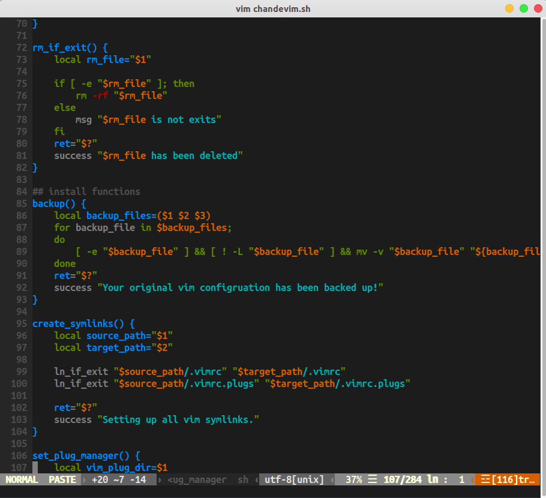

# Chandevim
## Introduction

This is a vim configuration forked form [spf13-vim](<https://github.com/spf13/spf13-vim>). In order to fit my requrment, I change a lot of settings from original configuration.

The project is a distribution of vim plugs and configuration of vim. It is easy to install/update/remove the vim configuration in Linux. 

Now [chandevim](https://github/chandelures/chandevim.git) is in development phase...

## Screenshot



## Install

### Linux

```shell
git clone https://github.com/chandelures/chandevim.git
cd chandevim
./chandevim.sh --install
```

## Usage

### Help

#### Linux

```shell
cd chandevim
./chandevim.sh --help
```

### Upgrade

#### Linux

```shell
cd chandevim
./chandevim.sh --upgrade
```

### Update Plugins

#### Linux

```shell
cd chandevim
./chandevim.sh --update
```

Or Manually

```shell
vim +PlugUpdate +qall
```

### Uninstall

#### Linux

```shell
cd chandevim
./chandevim.sh --remove
```

